<p align="center">
  
</p>

---

### 🖥️ SYSTEM RUNTIME DIAGNOSTICS // NEOCONSOLE

```text
====================================================================================================
[HOST_OS]     : Custom Linux Environment (Aggressive Kernel Optimization Profile Enabled)
[SHELL_ENV]   : Automated /bin/bash Control Engine (CLI Native Profile Over GUI Friction)
[MEMORY_MGMT] : Memory-Safe Abstractions, Highly Compressed Memory Structures (ZRAM Priority)
[STANDARDS]   : Zero Memory Leaks, Defending Local Sovereignty, Explicit Knowledge Graphs
====================================================================================================
```
🚀 NOW SHIPPING // ACTIVE ECOSYSTEMS (Geliştirilen Sistemler)
📊 TELEMETRY METRICS (Yerel Derlenen Grafik Katmanı)

<p align="center">
  
</p>

🛠️ INFRASTRUCTURE HARDWARE MATRIX
📡 Sistemi İlk Kez Tetikleme ve Başlatma Protokolü
